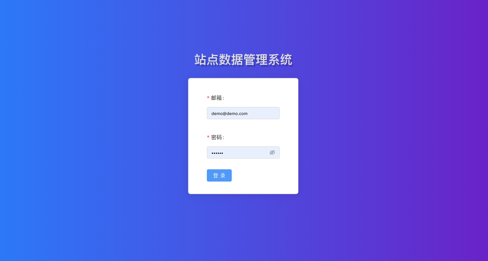
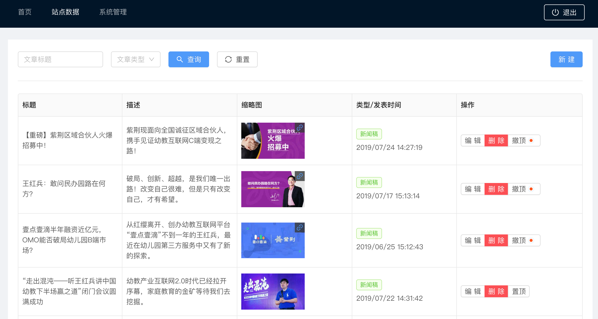
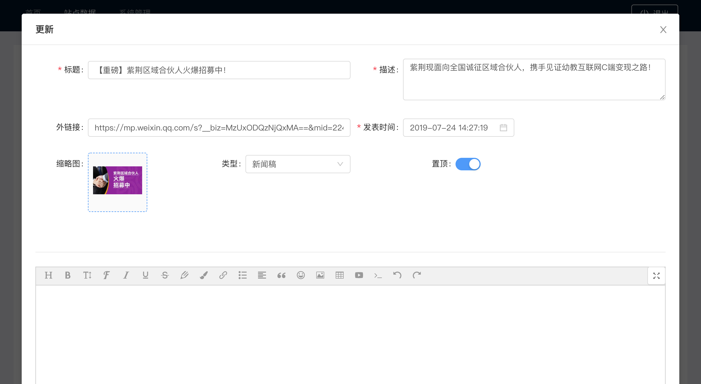
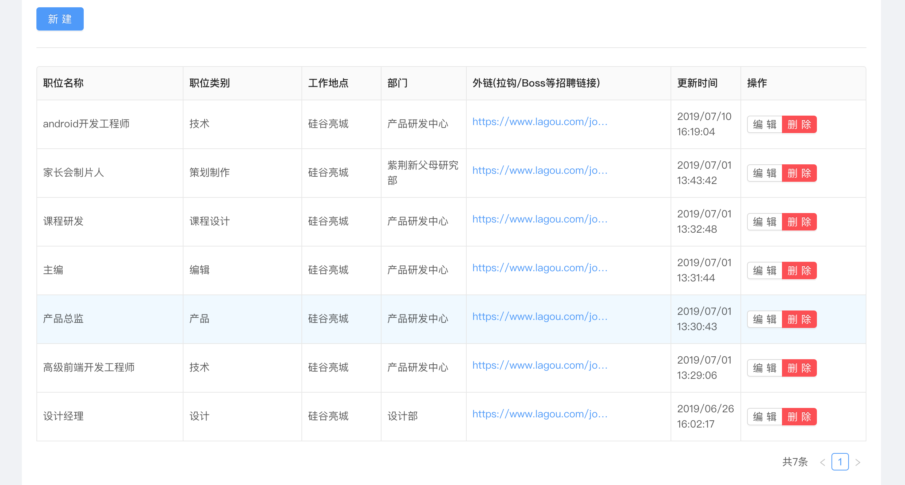

# 后台数据管理系统

演示地址：[https://ssde.yangerxiao.com](https://ssde.yangerxiao.com)
演示账号：demo/123123

## UI 截图






无他，又一套 CRUD（增删改查）后台数据管理系统，只不过用到的技术栈比较新（目前我所理解的最佳实践），具有一定的参考意义。

## 对应的官网展现

[文章列表页](http://web.1d1d100.com/1d1d/pc/news/)
[职位列表页](http://web.1d1d100.com/1d1d/pc/hire/)

## 技术关键词

- [GraphQL](https://graphql.org/)
- MongoDB/[mongoose](https://mongoosejs.com/docs/index.html)/mongoose-paginate-v2
- [Express](http://expressjs.com/)/express-graphql
- [apollo-client](https://www.apollographql.com/docs/react/)/react-apollo
- [react](https://reactjs.org)/[react-router](https://reacttraining.com/react-router/web/guides/philosophy)
- [antd](https://ant.design)
- [styled-components](https://styled-components.com)/styled-reset
- [pm2](http://pm2.keymetrics.io)

# 使用方式

## 前提条件

- 全局安装 pm2
- 本地或者远程装有 mongodb（配置数据库字符串）
- 图片上传接口(推荐使用[sm.ms](https://sm.ms)，当然，你也可以改成自己的图片上传接口）
- JWT token（一些自定义的随机字符串，用于用户登录验证）

> 强烈建议先熟悉下上面我提到的技术关键词，不然直接看代码会容易懵。每一个技术关键词背后有时会代表着一个知识领域，所以，如果有完全没接触过的点，建议先宏观上了解下这项技术的内涵和外延（做什么的，解决了什么问题，怎么用）

## 初始化环境

### 后端配置文件

拷贝一份`ecosystem.config.example.js`并重命名为`ecosystem.config.js`，pm2 会用到

### 前端配置文件

在`frontend`目录，拷贝一份`.env.example`并重命名为`.env`，用于初始化一些环境变量。

## 安装前端和后端用到的包

```sh
yarn init:packages
```

## 本地开发

```sh
# 前后端一起启动
yarn start
```

## 部署接口

```sh
# 服务器已全局安装pm2
yarn start:prod
```
